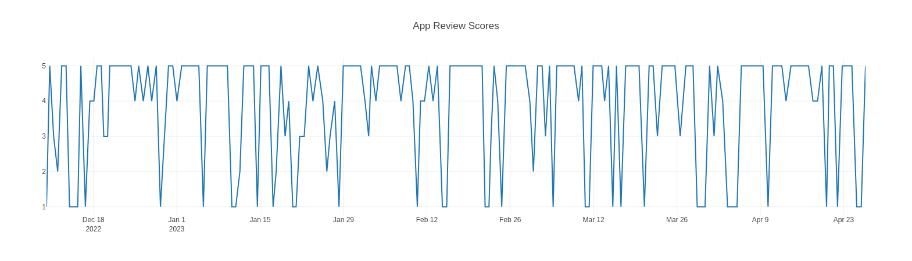

# Python-Dash

This repository contains a collection of Dash applications and examples.

## Getting Started
### Prerequisites
To run the applications in this repository, you will need to have Python 3 installed on your system. You can download the latest version of Python from the official website: https://www.python.org/downloads/

## Installation
1. Clone the repository:

``
git clone https://github.com/username/dash-repo.git
``

2. Navigate to the repository:

`cd Python-Das`

3. Create virtual environmentand activate:

`virtualenv env`

` . env/bin/activate` for linux and windows is `. env/Scripts/activate`

4. Install the required packages:

`pip install -r requirements.txt`

### Running the Applications

To run the python_dash.py file:

`python python_dash.py`

The application will then be available in your web browser at http://localhost:8050.

## Here is the images of graphs
App review scores

Number of Thumbs Up for Reviews
.png)

